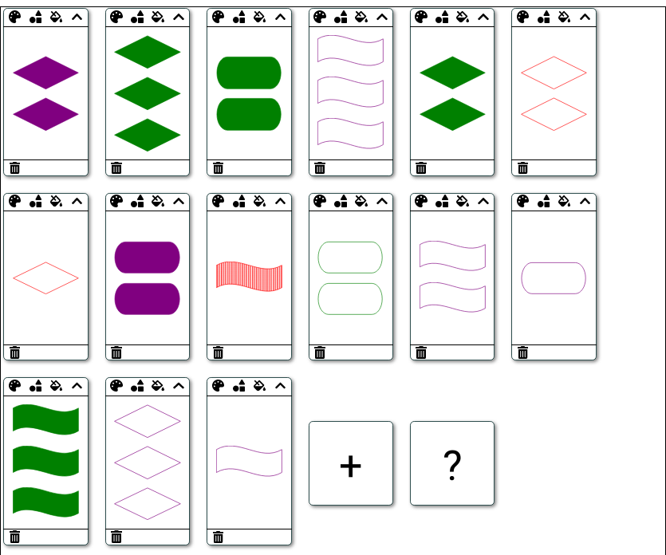

This project was bootstrapped with [Create React App](https://github.com/facebook/create-react-app).

## Set-Solver

An interactive solver for the funny game [set](https://en.wikipedia.org/wiki/Set_(card_game)).



See it [in action](https://set-solver.netlify.com/).

To run:

```
yarn
yarn start
```